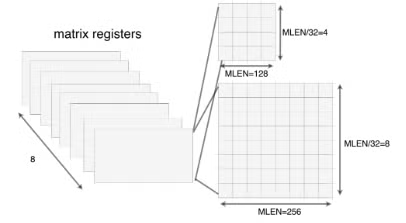
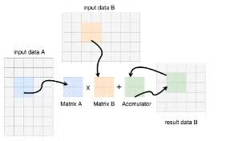

# RISC-V 矩阵扩展

AI领域，GEMM/GEMV是很重要的一类计算任务。像ARM有SME，X86有AMX，RISC-V也在努力推进矩阵扩展的标准化。

## 1 XuanTie MME

### 1-1 寄存器

XuanTie MME有8个矩阵寄存器，MLEN表示矩阵寄存器在列维的位宽(必须是2的幂次)，不同的MLEN代表的不同的算力，不同的芯片选择可以不同。

一个矩阵寄存器的行数等于MLEN/32，对于MLEN=128的矩阵寄存器而言，它能存储4×4个32bit的数据；对于MLEN=256的矩阵寄存器而言，它能存储8×8个32bit的数据。

指令的操作数的位宽是灵活的，支持4bit, 8bit, 16bit, 32bit等。XuanTie MME约定，element位宽的改变不会影响矩阵寄存器的行数，只会影响列数。比如对于MLEN=128的矩阵寄存器，如果要处理的element是64bit，那么其存储的是4×2个64bit的数据；如果要处理的element是16bit，那么其存储的是4×8个16bit的数据。

### 1-2 指令

#### 1-2-1 矩阵乘加指令

矩阵乘加指令是矩阵乘中的核心操作，XuanTie MME提供整型(mmaqa)和浮点型(fmmacc)两类。矩阵乘加指令做的事情是：矩阵A乘上矩阵B，结果加上矩阵C，最后写回矩阵C，其中矩阵A, B, C都是用矩阵寄存器来表示。

对于浮点型矩阵乘加指令，支持半精度和单精度，矩阵寄存器位宽在源和目的操作数中是一样的。对于整型矩阵乘加指令，支持8和16bit、有符号和无符号的源操作数，累加操作是有符号计算，所以会对乘法结果进行符号扩展，且目的操作数的位宽是源操作数的4倍，还支持pair类型(pmmaqa.b)，意味着一个8bit存的是两个4bit的数。

#### 1-2-2 矩阵访存指令

提供矩阵寄存器专门的load和store指令。还提供了hint，用于提示load进来的数据是否在未来还会被reuse，以此来提升存储效率。

#### 1-2-3 其他指令

甚至支持量化指令....还有一些其他的。spec仓库在这：[https://github.com/XUANTIE-RV/riscv-matrix-extension-spec](https://github.com/XUANTIE-RV/riscv-matrix-extension-spec)

tensor core的设计原理在这里有一篇讲的很好：[https://mp.weixin.qq.com/s/l0BFvb3K0Ce8r4RkjfJKkw](https://mp.weixin.qq.com/s/l0BFvb3K0Ce8r4RkjfJKkw)
