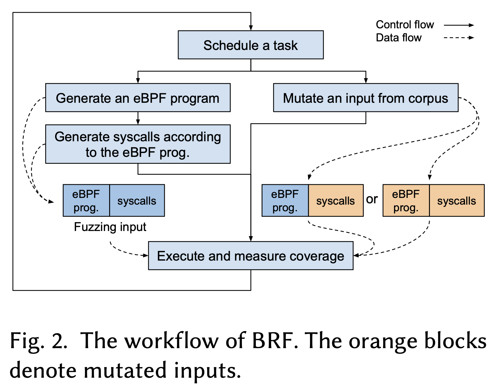

[https://ics.uci.edu/~ardalan/papers/Hung_FSE24.pdf](https://ics.uci.edu/~ardalan/papers/Hung_FSE24.pdf)

# Fuzzing the eBPF Runtime

## 1. Introduction (引言)

论文指出，Linux内核中的eBPF技术因其可编程性已被广泛应用于网络、追踪和安全等领域。它允许用户提供的eBPF程序直接在内核中执行，从而极大地提高了部署定制化逻辑的灵活性和效率。然而，eBPF也引入了一个全新且广泛的攻击面：恶意eBPF程序可能会尝试利用内核中eBPF子系统的漏洞。

模糊测试是发现此类漏洞的一种有效技术。但论文通过实验发现，最先进的内核模糊测试工具Syzkaller无法有效测试eBPF运行时（负责执行eBPF程序的组件），主要原因有二：

1. **eBPF验证器拒绝**：许多模糊测试输入因不符合其要求的语义或缺少依赖项（如加载程序前需要调用的其他系统调用）而被eBPF验证器拒绝。
2. **执行触发失败**：Syzkaller大多数时候无法附加并触发eBPF程序的执行。

为此，论文提出了BPF运行时模糊测试器（BRF），它能够生成满足验证器和eBPF子系统要求的语义和依赖关系的测试输入。实验表明，BRF在有效执行程序数量、代码覆盖率和漏洞发现方面均显著优于Syzkaller和Google近期发布的eBPF模糊测试器Buzzer。

## 2. Background (背景)

**eBPF工作流程**：分为加载、附加和执行三个阶段。加载涉及将eBPF程序加载到内核，并通过验证器检查；附加是将程序挂载到内核的钩子点；执行是当相应事件触发时运行程序。

**eBPF验证器**：负责静态检查用户空间程序的安全性，防止无限执行、无效跳转、无效内存访问和内核敏感数据泄露。它通过跟踪寄存器状态（包括值的潜在范围和类型）来实现这一点。

**eBPF运行时组件**：指在eBPF程序通过验证器后执行它的部分，主要包括：

* **JIT编译器**：将验证后的eBPF程序编译成本地机器代码。
* **解释器**：在JIT禁用或不支持的架构上，负责解释执行eBPF字节码。
* **eBPF Maps**：eBPF程序使用的持久化键值存储，有31种不同类型。
* **辅助函数**：eBPF程序与内核交互的预定义函数集，有213个，其可用性取决于程序类型。

## 3. Motivation (研究动机)

现有的内核模糊测试器（如Syzkaller）和专门的eBPF模糊测试器（如Buzzer）在测试eBPF运行时组件时效率低下。论文实验显示：

* Syzkaller生成的程序只有19.5%能通过验证器，且通过的程序非常简单（平均指令数仅4.86条），表达能力有限。
* Buzzer的指针算术模糊测试策略生成的程序中，仅0.1%能通过验证器。
* 两者在附加和触发程序执行方面也存在困难。

因此，迫切需要一种能够有效生成**语义正确**、满足**系统调用依赖**并能成功**触发执行**的eBPF测试输入的模糊测试器，以深入测试eBPF运行时组件。

## 4. Key Insight (核心见解)

BRF的核心见解在于通过系统化的方法理解和满足eBPF子系统的复杂约束，从而高效生成能到达并测试运行时的输入。

1. **语义正确性生成**：不是手动分析所有验证器规则，而是采用**迭代的、错误消息驱动的方法**来识别和整合关键的语义规则。同时，在**源代码级别**进行程序生成和变异，利用编译器自动处理许多基本语义（如避免无效跳转），从而更易于生成合规程序。
2. **依赖感知的输入生成**：通过自动化分析（尽可能）和手动研究，提取eBPF程序与预备系统调用（如创建Map）之间的依赖关系，并在生成测试输入时满足这些依赖。
3. **执行触发保障**：不仅生成加载程序的系统调用，还主动生成用于附加程序到钩子点以及触发相应事件（执行程序）的系统调用。

## 5. Challenge (挑战与解决方案)

### 挑战1：生成语义正确的eBPF程序

* **解决方案**：
  * **关键方法1（迭代整合语义规则）**：运行初始模糊测试器，根据频繁触发（>1次/小时）的验证器错误消息，识别关键语义规则，并将这些规则作为约束集成到程序生成/变异逻辑中。论文最终为82条语义规则显式添加了约束。
  * **关键方法2（源码级生成/变异）**：通过生成C代码并编译成eBPF字节码，利用编译器保证语法正确性和基本语义正确性（如不生成无效跳转），简化了合规程序的生成。
  * **具体规则处理示例**：
    * **辅助函数可用性**：自动解析内核源码，确定不同程序类型可用的辅助函数集合，生成时只随机选择可用的函数。
    * **辅助函数参数类型**：解析内核中的辅助函数原型和类型兼容信息，生成类型匹配的参数。
    * **变量安全检查**：跟踪指针变量的有效状态（如是否可能为NULL），在将指针传递给辅助函数前自动插入必要的安全检查（如非空检查、边界检查）。
    * **程序上下文访问**：提取不同程序上下文结构的字段定义和访问权限，生成有效的上下文访问。
    * **引用计数**：检查并确保获取引用的辅助函数与释放引用的辅助函数正确配对。

### 挑战2：满足eBPF程序的系统调用依赖

* **解决方案**：
  * **创建兼容的Maps**：根据eBPF程序中使用的辅助函数和程序类型，确定所需的Map类型及其属性约束，然后生成正确的 `BPF_MAP_CREATE`系统调用来创建兼容的Map。
  * **重定位eBPF程序**：利用 `libb`库的API来处理程序加载过程中所需的重定位等复杂步骤，确保程序能成功加载。这些预备系统调用在测试输入中保持不变，不被变异。

### 挑战3：附加并执行eBPF程序

* **解决方案**：
  * **程序附加**：对于需要在附加时指定入口点的程序类型，生成必要的系统调用来创建和打开资源（如LIRC设备），并将其用于附加系统调用。
  * **触发执行**：
    1. 针对7种类型的eBPF程序（如跟踪相关、网络相关），显式生成系统调用来触发相关事件（如调用 `recv`、向设备写入信号）。
    2. 广泛使用 `BPF_PROG_TEST_RUN`系统调用，该调用在内核中构建模拟环境来测试运行eBPF程序，适用于难以设置的复杂子系统。

## 6. Design (设计)

BRF的整体设计如图1所示，主要包括两个阶段：

1. **领域知识提取**：通过研究源码和自动化脚本，提取eBPF语义和系统调用依赖关系。
2. **模糊测试阶段**：利用提取的知识生成测试输入。其工作流程（图2）是一个覆盖引导的循环：
   * **调度器**选择生成新的eBPF程序或变异语料库中的现有程序。
   * **eBPF程序生成/变异**：随机选择程序类型和目标辅助函数，递归生成类型正确的参数，并遵守语义规则，最终编译为字节码。
   * **系统调用生成**：生成加载、附加、触发该eBPF程序所需的系统调用，并附加其他随机BPF系统调用。
   * **执行与反馈**：执行测试输入，收集覆盖信息（通过扩展kcov机制来收集eBPF程序自身的覆盖范围），引导模糊测试进程。

## 7. Evaluation (评估)

论文在48小时模糊测试会话中，将BRF与Syzkaller和Buzzer进行了比较。

* **到达运行时组件**：

  * **程序加载成功率**：BRF高达97.6%，远高于Syzkaller (19.5%) 和 Buzzer (0.1%)。
  * **程序附加与执行**：BRF能成功附加89.9%的已加载程序，并触发66.8%的已附加程序执行。总体而言，BRF成功执行的eBPF程序数量是Syzkaller的8倍，是Buzzer的32倍。
* **eBPF程序表达能力**：

  * BRF生成的程序在平均指令数、调用的辅助函数数量、使用的Map数量方面均远高于Syzkaller生成的程序（例如，辅助函数调用多27.4倍）。Buzzer的程序虽长，但辅助函数和Map类型单一固定。
* **代码覆盖率**：

  * 在eBPF运行时组件（JIT、解释器、辅助函数、Maps）的代码覆盖率上，BRF持续探索新路径，最终覆盖的基本块数量比Syzkaller多101%。Syzkaller的覆盖率在5小时后即趋于平缓。
* **漏洞发现**：

  * BRF已发现6个新的漏洞（其中2个已获得CVE编号，见表4），证明了其在寻找被严密保护的运行时组件中漏洞的能力。这些漏洞涉及越界访问、信息泄露、死锁、内存泄漏等类型。

## 8. Conclusion (结论)

论文提出了BPF运行时模糊测试器（BRF），它通过系统化的方法解决了有效测试eBPF运行时的三个关键挑战：

1. 生成语义正确的eBPF程序（通过迭代错误消息驱动整合规则和源码级生成）。
2. 满足eBPF程序的系统调用依赖。
3. 生成附加和触发eBPF程序执行的系统调用。

实验结果表明，BRF在有效执行程序数量、程序表达能力和代码覆盖率方面均显著优于现有技术，并成功发现了多个真实漏洞，证明了其有效性。
