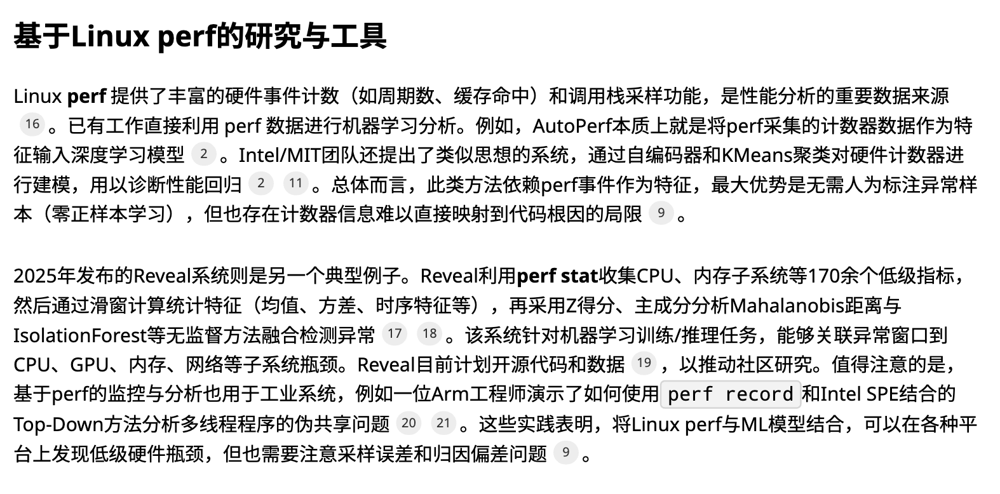
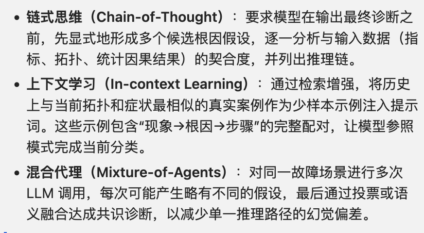
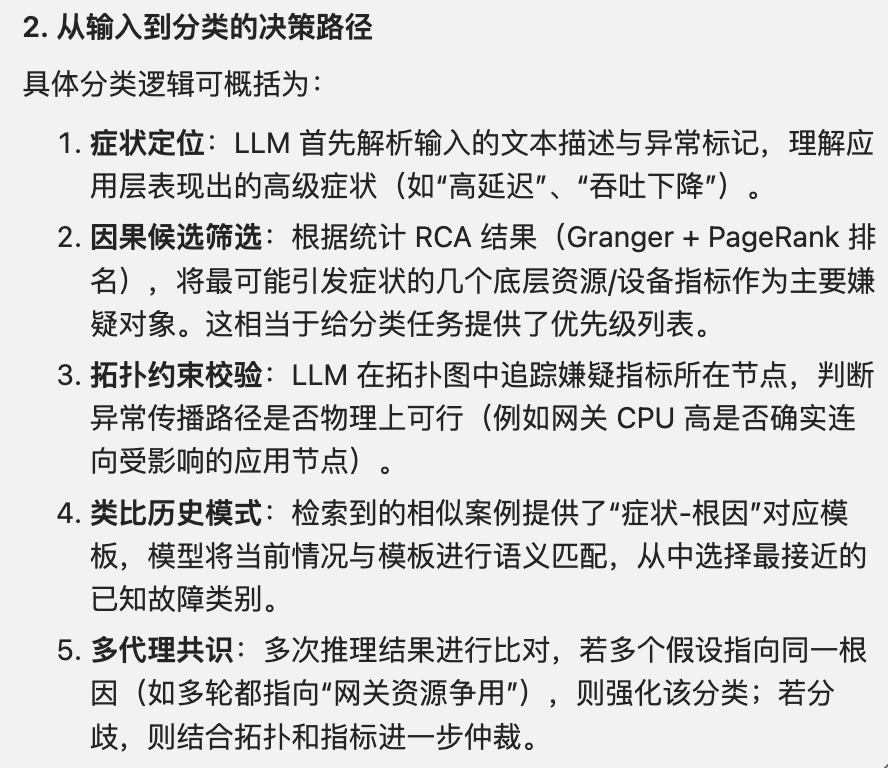
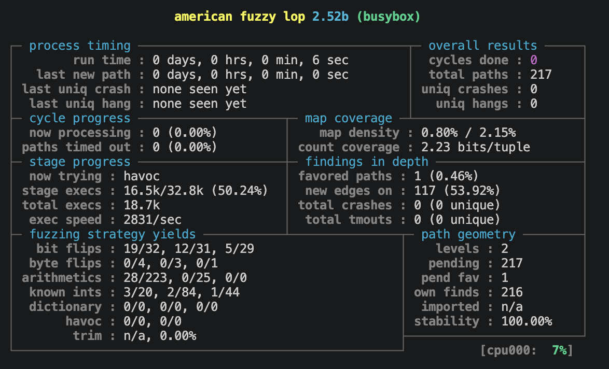

# OpenSkills, RCAgent, HipKittens, busybox-afl

## HipKittens·

---

  项目一：HipKittens — 让 AMD GPU 也能跑出高性能 AI 内核

  ★ Insight ─────────────────────────────────────
  HipKittens 的核心理念是 "hardware-up" 设计——不从抽象模型出发，而是直接从 AMD 芯片的物理特性（64-wide wavefront、8 XCD chiplet、MFMA
  指令集）来设计编程原语。这跟 PyTorch/Triton 那种 "从上往下" 的抽象思路正好相反。
  ─────────────────────────────────────────────────

  Motivation

  HipKittens 来自 Stanford Hazy Research 实验室，被 MLSys 2026 接收。它要回答一个核心问题：

  ▎ NVIDIA GPU 的 tile-based 编程范式（ThunderKittens）能不能平移到 AMD GPU？还是说 AMD 的架构需要全新的原语？

  历史上 NVIDIA 靠 CUDA 生态（cuBLAS、CUTLASS、ThunderKittens）主导了 AI 计算。HipKittens
  想验证：同一个软件框架能否在不同硬件平台上都能高效运行。

  结论是：tile 和 bulk-compute 接口可以跨平台，但 内存访问模式、计算与调度的重叠方式、以及 AMD chiplet 架构下的线程块组织方式 都需要重新设计。

  怎么做的

  HipKittens 是一个 C++20 embedded DSL，通过 HIP + 内联汇编直接操作 AMD GPU 硬件：

  ┌──────────┬────────────────────────────────────────────────────────────────┐
  │   层级   │                              说明                              │
  ├──────────┼────────────────────────────────────────────────────────────────┤
  │ 硬件支持 │ CDNA3 (MI300X/MI325X, gfx942) 和 CDNA4 (MI350X/MI355X, gfx950) │
  ├──────────┼────────────────────────────────────────────────────────────────┤
  │ 三级并行 │ warp级 (64线程)、group级 (多warp协作)、kernel级 (全局调度)     │
  ├──────────┼────────────────────────────────────────────────────────────────┤
  │ 四大原语 │ tile原语、bulk操作(load/store/mma)、异步加载、调度与重叠模式   │
  └──────────┴────────────────────────────────────────────────────────────────┘

  数据流 很简单：global memory (HBM) → shared memory (LDS) → registers (VGPR/AGPR) → 计算 → 反向写回。每个层级都有对应的 C++
  类型（gl`<T>`、st`<T>`、rt`<T>`）。

  关键实现细节：

- 64-wide warps（AMD 的 wavefront 是 64 线程，不是 NVIDIA 的 32）
- Chiplet 感知调度：AMD MI300X 有 8 个 XCD chiplet，需要特殊的数据分布来最大化 L2 缓存局部性
- Swizzled shared memory：通过 swizzle 模式避免 bank conflict
- 直接内联汇编：所有性能关键路径手写 asm volatile(...)，不信任编译器优化

  项目结构

  HipKittens/
  ├── include/            # ★ 核心库：类型系统 (types/) + 操作 (ops/) + 通用工具 (common/)
  │   ├── types/          # register/shared/global 三种层级的数据类型
  │   ├── ops/            # warp级和group级的操作 (load/store/mma/reduce)
  │   └── common/         # 宏汇编、类型转换、调试工具
  ├── kernels/            # ★ 示例内核：GEMM、Attention、RoPE、LayerNorm、Softmax
  ├── training/           # 端到端训练：BERT 和 Llama 预训练
  ├── analysis/           # 基准测试 + 结果图表
  ├── distributed-kernels/# 多GPU分布式内核
  ├── tests/unit/         # 单元测试
  └── docs/               # Docker 环境、性能分析指南

  ▎ 值得一提的是，2026 年 3 月 HipKittens 正式成为 AITER（AMD 的官方 tensor 库）的 backend，可以用作 ROCm 生态的即插即用替代。

---

  项目二：Kernel Design Agents (KDA) — 让 AI 帮你写 AI 内核

  ★ Insight ─────────────────────────────────────
  KDA 的精妙之处在于 "separation of concerns"：workflow 定义（这个仓库）保持纯参考性质、task-agnostic，而所有具体实现都在独立的 task workspace
  中进行。这样同一个优化流程可以套用在任何 kernel 竞赛/项目上，不需要改动框架本身。
  ─────────────────────────────────────────────────

  Motivation

  这个项目来自 MIT HAN Lab。它的出发点更直接：

  ▎ 写高性能 CUDA kernel 太难了，需要懂 SM100 tensor core、TMEM、CLC、TMA、NVFP4… 而且要靠 Nsight Compute 反复 profiling
  ▎ 迭代。人工做这事儿又慢又贵。

  KDA 想创建一个 agent-driven 的可重复工作流，让 Claude Code 能自主完成：调研 → 实现 → 验证 → 迭代 的全流程。

  成绩：HAN Lab 团队用 KDA 在 MLSys 2026 FlashInfer Full-Agent 竞赛 中拿到了 MoE 第1、DSA 第2、GDN 第3。

  怎么做的

  KDA 本身不写任何 benchmark 代码，它是一个纯 workflow 定义 + 三个技能的编排系统：

  核心循环

  定义任务契约 → 检查 workspace → 写 draft plan → 转可执行 plan
  → 实现 → 验证正确性 → 测量性能 → 记录证据 → 晋升/修改/拒绝 → 迭代

  三个关键技能（git submodule）

  ┌─────────────────────────────────────┬───────────────────────────────────────────────────────────────────────────────────────────────────┐
  │                技能                 │                                               作用                                                │
  ├─────────────────────────────────────┼───────────────────────────────────────────────────────────────────────────────────────────────────┤
  │ Humanize (PolyArch 的 Claude Code   │ 核心贡献者。提供结构化的 planning + RLCR (Read-Loop-Code-Review) 循环。消融实验显示它贡献最大     │
  │ 插件)                               │                                                                                                   │
  ├─────────────────────────────────────┼───────────────────────────────────────────────────────────────────────────────────────────────────┤
  │ KernelWiki                          │ Blackwell/Hopper GPU 内核优化的结构化知识库：2179 个 PR 引用、48 篇 wiki 合成页、20 篇博客、11    │
  │                                     │ 篇文档摘要                                                                                        │
  ├─────────────────────────────────────┼───────────────────────────────────────────────────────────────────────────────────────────────────┤
  │ ncu-report-skill                    │ 完整的 Nsight Compute profiling 工具链：构建 standalone harness、运行 ncu、解析报告、6            │
  │                                     │ 维分析、诊断 playbook                                                                             │
  └─────────────────────────────────────┴───────────────────────────────────────────────────────────────────────────────────────────────────┘

  证据驱动的晋升机制

  每个 candidate kernel 必须：

1. 满足任务契约的正确性要求
2. 有可测量的性能提升证据
3. 记录 profiling 数据到 candidates.jsonl
4. 被拒绝的 candidate 也要记录原因

  项目结构

  kernel-design-agents/
  ├── README.md              # 总览 + 快速开始
  ├── CLAUDE.md              # 这个 repo 的 agent 指令（保持 task-agnostic）
  ├── prompts/
  │   ├── README.md
  │   └── basic-flow.md      # ★ 通用 starter prompt + 任务契约模板
  ├── docs/
  │   └── agent-flow.md      # 端到端工作流文档
  └── skills/                # git submodules
      ├── KernelWiki/        → https://github.com/mit-han-lab/KernelWiki
      └── ncu-report-skill/  → https://github.com/mit-han-lab/ncu-report-skill

  典型工作流

1. 创建 task workspace（从竞赛 starter kit 复制）
2. 定义任务契约（objective/correctness/constraints/validation/promotion criteria）
3. 启动 Claude Code agent → 传入 basic-flow.md + 任务细节
4. Agent 写 docs/draft.md（baseline、风险、候选方向）
5. 转成可执行 plan → 实现一个 candidate → 验证 → profiling → 记录
6. 循环直到满足晋升标准

---

  对比总结

  ┌──────────┬─────────────────────────────────┬─────────────────────────────────────────┐
  │   维度   │           HipKittens            │          Kernel Design Agents           │
  ├──────────┼─────────────────────────────────┼─────────────────────────────────────────┤
  │ 实验室   │ Stanford Hazy Research          │ MIT HAN Lab                             │
  ├──────────┼─────────────────────────────────┼─────────────────────────────────────────┤
  │ 目标     │ 让 AMD GPU 高效跑 AI kernel     │ 让 AI agent 自动写 CUDA kernel          │
  ├──────────┼─────────────────────────────────┼─────────────────────────────────────────┤
  │ 本质     │ C++ 编程库 / embedded DSL       │ Agent 工作流框架                        │
  ├──────────┼─────────────────────────────────┼─────────────────────────────────────────┤
  │ 硬件     │ AMD CDNA3/CDNA4 (MI300X/MI350X) │ NVIDIA Blackwell (B200) / Hopper (H100) │
  ├──────────┼─────────────────────────────────┼─────────────────────────────────────────┤
  │ 技术栈   │ HIP、内联汇编、C++20、pybind11  │ Claude Code、Humanize、KernelWiki、ncu  │
  ├──────────┼─────────────────────────────────┼─────────────────────────────────────────┤
  │ 成果     │ MLSys 2026 论文                 │ MLSys 2026 竞赛 #1 MoE                  │
  ├──────────┼─────────────────────────────────┼─────────────────────────────────────────┤
  │ 设计哲学 │ hardware-up，暴露硬件细节       │ evidence-driven，agent 自主迭代         │
  └──────────┴─────────────────────────────────┴─────────────────────────────────────────┘

  共同点：两者都在做 AI 基础设施的性能优化，而且都选择了在 抽象层尽量贴近硬件 的路线 —— HipKittens 用 C++ 模板和汇编暴露 AMD 的硬件特性，KDA 用
  structured workflow 让 agent 能系统性地探索 NVIDIA 硬件的优化空间。

## OpenSkills

>
>  所以逻辑是这样的，虽然skill一般都是自然语言构成的md文档，但是其具体实现方式在不同的agent上是不一样的。比如这个文档的格式要求在不同的agent上不一致，甚至有的是mdc而不是md，虽然不同agent的skill
>   实现差别不大，但在迁移skill的时候总归是要有迁移成本的。openskills的动机就是这个，它的做法是以claude
>   code的skill实现方式为标准，外面包了一层cli，通过修改agent的agent.md文件来实现当需要调用技能的时候，使用opencode的cli，即shell即可，规避了skill在跨agent迁移时的代价。
>
> ● 完全正确，你总结得非常精准。让我加点细节来印证你的理解：
>
>   你说的每一步都对
>
>   ▎ "以 Claude Code 的 skill 实现方式为标准"
>
>   没错。OpenSkills 选择 Claude Code 的 SKILL.md 格式作为事实标准是有原因的——Anthropic 发布了一套完整的 skill 规范（YAML frontmatter + 祈使句指令 + progressive disclosure
>   三级加载），而且生态里已经有大量现成的 skills（anthropics/skills marketplace 等）。选它做基准是最务实的选择。
>
>   ▎ "外面包了一层 CLI"
>
>   对，这个 CLI 就是最薄的一层抽象：
>
> - install = git clone + 复制文件
> - sync = 生成 XML 块塞进 AGENTS.md
> - read = cat SKILL.md
>
>   没有任何运行时的魔法。
>
>   ▎ "通过修改 agent 的 AGENTS.md 来实现调用"
>
>   这是最巧妙的部分。AGENTS.md 这个文件名本身就是一种约定——Cursor 读 .cursor/rules/，Windsurf 读 .windsurf/rules/，但越来越多的 agent 约定会读根目录的 AGENTS.md 或 CLAUDE.md
>   作为系统提示入口。OpenSkills 赌的就是这个收敛趋势，而不用去给每个 agent 单独写适配器。
>
>   ▎ "当需要调用技能的时候，使用 CLI（即 shell）"
>
>   这是一个非常聪明的降维打击。其他 agent 可能没有 Skill() 工具，但所有 agent 都会跑 shell 命令。npx openskills read `<name>` 这个调用在所有环境里语义一致。
>
>   迁移成本的本质
>
>   你说到核心了。如果手工迁移一个 skill：
>
>   Cursor:     .cursor/rules/pdf.mdc          (YAML frontmatter + 特定格式)
>   Windsurf:   .windsurf/rules/pdf.md         (不同格式)
>   Aider:      CONVENTIONS.md 里手动追加       (纯手写)
>   Claude Code: .claude/skills/pdf/SKILL.md   (标准格式)
>
>   每换一个 agent 就要做一次格式转换。而 OpenSkills 的做法是：
>
>   所有 agent → 读 AGENTS.md → 执行 npx openskills read pdf → 读到同一份 SKILL.md
>
>   维护一份，到处运行。
>
>   你还有什么想深入聊的？比如 OpenSkills 这么做的 trade-off（比如依赖 npx 意味着需要网络）、或者跟 MCP 的定位对比？
>
> ❯ 这是不是要求agent起码都要有一个AGENT.md
>
> ● 好问题。答案是：不完全是——准确地说，这个方案要求 agent 有某种方式把 AGENTS.md 的内容注入到上下文中，但不一定非要叫 AGENTS.md。
>
>   实际情况是：不同 agent 有不同的「入口文件」
>
>   ┌─────────────┬──────────────────┬──────────────────────────┐
>   │    Agent    │     入口文件     │    能否引用 AGENTS.md    │
>   ├─────────────┼──────────────────┼──────────────────────────┤
>   │ Claude Code │ CLAUDE.md        │ 能，通过 @AGENTS.md      │
>   ├─────────────┼──────────────────┼──────────────────────────┤
>   │ Gemini CLI  │ GEMINI.md        │ 理论上可以加类似引用     │
>   ├─────────────┼──────────────────┼──────────────────────────┤
>   │ Cursor      │ .cursor/rules/   │ 不行，但可以复制内容进去 │
>   ├─────────────┼──────────────────┼──────────────────────────┤
>   │ Windsurf    │ .windsurf/rules/ │ 同上                     │
>   ├─────────────┼──────────────────┼──────────────────────────┤
>   │ Aider       │ CONVENTIONS.md   │ 可以手动粘贴             │
>   └─────────────┴──────────────────┴──────────────────────────┘
>
>   OpenSkills 的做法其实是两步：
>
>   AGENTS.md 里有 skill 列表 + 使用说明
>            ↕
>   能不能进 agent 的上下文 → 取决于 agent 自己的入口文件机制
>
>   如果 agent 不支持读 AGENTS.md，你可以手动把 AGENTS.md 里的内容粘贴到该 agent 的入口文件里。效果是一样的——agent 知道了有这些 skill，知道用 npx openskills read `<name>` 来调用。
>
>   所以 OpenSkills 的实际覆盖范围
>
> - Claude Code → 原生最佳体验（@AGENTS.md 自动注入）
> - Gemini CLI → 应该也可以，有类似的入口文件机制
> - Cursor / Windsurf / Aider → 需要手动将 skill metadata 复制到对应的规则文件中
> - Codex CLI → 同理
>
>   换个角度看
>
>   OpenSkills 真正标准化的是两件事：
>
> 1. Skill 的存储格式 — 统一用 SKILL.md（Claude Code 标准）
> 2. Skill 的调用接口 — 统一用 npx openskills read `<name>`（shell 命令）
>
>   但它没有标准化「skill 列表怎么进 agent 的上下文」。这一层还是需要因 agent 而异的适配。
>
>   所以你的直觉是对的——这确实是 OpenSkills 的一个隐含假设。如果某个 agent 既没有入口文件机制，也不允许从项目目录读取说明文件，那 OpenSkills 就覆盖不到了。但这类 agent 实际上很少见，因为几乎所有的
>    coding agent 都需要某种方式来理解项目的约定和指令。

  OpenSkills 的动机

  用一句话说就是：

  ▎ 把 Anthropic 为 Claude Code 设计的 skills 系统，移植到所有其他 AI coding agent 上。

  具体拆解来看：

1. 问题：Skills 是 Claude Code 的「独占」功能

  Anthropic 设计了一套很好的机制：

- 用 SKILL.md 写指令
- 用 <available_skills> XML 在系统提示中注册
- 通过 Skill("name") 工具按需加载

  但 只有 Claude Code 原生支持这套流程。Cursor、Windsurf、Aider、Gemini CLI、Codex 等其他 agent 根本不知道 Skill 工具是什么，也没法解析 <available_skills> XML 块。

2. 方案：命令行 + AGENTS.md = 通用加载器

  OpenSkills 的解法非常巧妙——既然其他 agent 不认识 Skill 工具，那就把它翻译成所有 agent 都有的能力：运行 shell 命令。

  Claude Code:     Skill("pdf")                    → 原生加载
  其他 agent:      bash("npx openskills read pdf")  → 也能加载

  流程是：

1. npx openskills install — 把 skills 下载到 .claude/skills/
2. npx openskills sync — 在 AGENTS.md 中生成 <available_skills> XML（任何 agent 都能读的 Markdown）
3. Agent 读到 AGENTS.md 后，调用 npx openskills read `<name>` 来加载 skill 内容
4. 你提到的「skill 是 agent 无关的」——完全正确

  这就是 OpenSkills 的设计哲学。一个 SKILL.md 文件：

- 是纯文本 + YAML 头——任何 LLM 都能解析
- 没有运行时依赖——不需要跑 server，不需要 MCP 支持
- 指令是祈使句——写的是"做什么"，而不是"针对 Claude Code 做什么"
- 存量兼容——同一个 skill 在 Claude Code 里用原生 Skill() 加载，在其他 agent 里用 npx openskills read 加载，skill 文件本身不用改

  这就是为什么项目中 CLAUDE.md 只有一行 @AGENTS.md——它把自己的 agent 指令也指向 AGENTS.md，证明 Claude Code 和其他 agent 可以从同一个入口消费 skills。

4. 为什么选 CLI 而不是 MCP？

  FAQ 里有直接讨论。关键区别：

  ┌─────────────────────┬─────────────────┬───────────────────────────────┐
  │                     │       MCP       │          CLI + 文件           │
  ├─────────────────────┼─────────────────┼───────────────────────────────┤
  │ 需要运行 server     │ 是              │ 否                            │
  ├─────────────────────┼─────────────────┼───────────────────────────────┤
  │ 需要 agent 支持 MCP │ 是              │ 否（只要会跑 shell 命令就行） │
  ├─────────────────────┼─────────────────┼───────────────────────────────┤
  │ skills 只是文件     │ 否              │ 是                            │
  ├─────────────────────┼─────────────────┼───────────────────────────────┤
  │ 跨 agent 兼容       │ 仅限支持 MCP 的 │ 所有 agent                    │
  └─────────────────────┴─────────────────┴───────────────────────────────┘

  Skills 本质上就是静态指令，不需要动态协议。用 CLI 来读文件，是最薄、最通用的抽象层。

---

  所以总结一下：OpenSkills 不是发明了一个新概念，而是把已有的 skill 格式（SKILL.md）桥接到所有 agent 都能用的方式上。 你的理解完全正确——skill 本身是 agent 无关的，OpenSkills
  做的就是让这个「无关性」在实践中成立。

## AI辅助软件性能缺陷根因分析

没有找到任何以 Linux perf（perf record / perf stat / PMC 硬件计数器）作为 LLM Agent 输入做根因分析的论文

### RCA Copilot(EuroSys'23)

场景：大型网络基础设施的运维故障诊断

缺陷根因分类：人为预定义类别，比如高应用带宽消耗、高应用延迟、高GPU利用率、NIC ACK超时错误、网关丢包等8种

基于什么信息做缺陷分析：原始观测数据(节点指标快照、网络拓扑)、领域知识(如工程师已知的指标间因果关系(网关 CPU 高往往导致下游应用延迟上升)、历史案例)

信息如何映射到缺陷根因：结构化的提示词工程和多阶段推理流程。LLM：假设生成->验证->共识

## BusyBox-afl

BusyBox1.38.0的源码中，被KConfig管辖的代码比例有73.7%

https://github.com/claroty/busybox-fuzzing 里面有教程，按照step来做就好了

